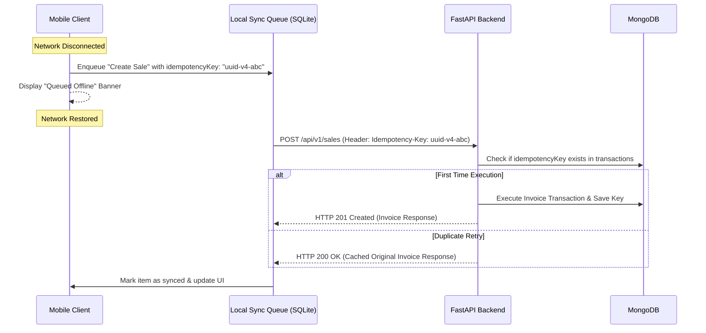

# Offline Caching & Synchronization Architecture

## 1. Objectives & Scope
While the MVP is online-first, retail environments frequently experience transient network loss. The offline architecture ensures:
1. **Catalog & Customer Browsing**: Cashiers can browse items and customers even without an active internet connection.
2. **Idempotent Mutation Queue**: Invoices or transactions submitted during network dropouts are queued locally with unique idempotency keys and safely synchronized without creating duplicate entries.

---

## 2. Local Storage Strategy (Mobile)
- **Local Master Database**: SQLite (via `expo-sqlite` or WatermelonDB) / TanStack Query persisted cache.
- **Cached Datasets**:
  - `items`: Active product catalog, prices, tax rates, SKU, and QR payload mapping.
  - `parties`: Customer/supplier directory with contact info.
  - `business_settings`: Tax config, invoice prefix, store metadata.
- **Sync Trigger**:
  - On app launch, on pull-to-refresh, or periodically in the background via incremental timestamp sync (`GET /api/v1/items?updated_since=...`).

---

## 3. Mutation Queue & Idempotency Key Pattern



---

## 4. Backend Idempotency Middleware (FastAPI)

```python
from fastapi import Request, Response, HTTPException
import json

async def idempotency_middleware(request: Request, call_next):
    idempotency_key = request.headers.get("Idempotency-Key")
    if not idempotency_key or request.method not in ["POST", "PUT", "PATCH"]:
        return await call_next(request)

    redis = request.app.state.redis
    cached = await redis.get(f"idempotency:{idempotency_key}")
    if cached:
        cached_data = json.loads(cached)
        return Response(
            content=cached_data["body"],
            status_code=cached_data["status_code"],
            media_type="application/json",
            headers={"X-Cache-Lookup": "HIT"}
        )

    response = await call_next(request)
    
    if response.status_code in [200, 201]:
        body = [chunk async for chunk in response.body_iterator]
        body_str = b"".join(body).decode()
        await redis.setex(
            f"idempotency:{idempotency_key}",
            86400,  # 24 hour TTL
            json.dumps({"status_code": response.status_code, "body": body_str})
        )
        return Response(content=body_str, status_code=response.status_code, media_type="application/json")

    return response
```

---

## 5. Conflict Resolution Rules

| Scenario | Resolution Strategy |
| :--- | :--- |
| **Stock discrepancy during offline sale** | If item is sold out on server when offline queue syncs, flag invoice as `PENDING_REVIEW` with an admin alert rather than silently overwriting. |
| **Concurrent Customer Update** | Last-Write-Wins based on `updatedAt` timestamp. |
| **Invoice Numbering** | Invoices generated offline use temporary local IDs (`OFF-xxxx`); the server assigns canonical sequence (`INV-2026-000143`) on sync. |

---

## 6. Verification Checklist
- [ ] Network status changes trigger NetInfo listener.
- [ ] Idempotency key prevents duplicate billing on double taps or flaky connections.
- [ ] Cached product catalog allows offline QR code lookups.
