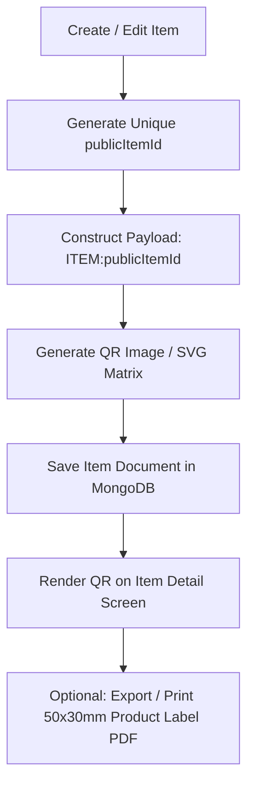

# QR Billing & Item Identification

## 1. Core Principles & Payload Specifications

### 1.1. Safe Payload Structure
All item QR codes generated by the application MUST adhere strictly to the prefix format:
```text
ITEM:<publicItemId>
```
*Example:* `ITEM:itm_9f8a7b6c5d4e`

### 1.2. Security Rules (What NOT to encode)
- **NEVER** encode raw MongoDB internal `_id` (`ObjectId`).
- **NEVER** encode prices, discounts, tax rates, or item names in the QR payload (these are mutable and must be fetched authoritatively from the server).
- **NEVER** encode user authentication tokens, API keys, or sensitive customer PII.
- **Cross-Tenant Protection**: The API lookup endpoint `/items/lookup/qr/{publicItemId}` MUST verify that the resolved item belongs to the authenticated user's current `businessId`. If the QR code belongs to a different business, return a `404 Not Found` without disclosing any details.

---

## 2. QR Code Generation Workflow



### Label Dimensions & Layout
Standard barcode/label sticker format:
- **Size**: 50mm x 30mm (or 2 inch x 1 inch)
- **Contents**:
  1. Business / Store Name (Header, 8pt bold)
  2. Item Display Name (truncated if > 25 chars, 9pt bold)
  3. Centered QR Code (18mm x 18mm)
  4. SKU / Human-readable Item Code (8pt mono)
  5. MRP / Sale Price (e.g., `₹ 150.00 incl. tax`, 10pt bold)

---

## 3. QR Scanning During Point-of-Sale (POS)

### 3.1. Parsing & Validation Algorithm
```typescript
export interface ParsedQRResult {
  type: 'ITEM' | 'UNKNOWN';
  publicItemId?: string;
  error?: string;
}

export function parseBillingQR(payload: string): ParsedQRResult {
  if (!payload || typeof payload !== 'string') {
    return { type: 'UNKNOWN', error: 'Empty or invalid QR code format.' };
  }

  const trimmed = payload.trim();
  if (trimmed.startsWith('ITEM:')) {
    const publicItemId = trimmed.substring(5).trim();
    if (publicItemId.length >= 6) {
      return { type: 'ITEM', publicItemId };
    }
  }

  return { type: 'UNKNOWN', error: 'Unrecognized barcode/QR code for billing.' };
}
```

### 3.2. Billing Cart Addition Logic
1. Cashier scans QR code with device camera.
2. App parses payload and calls `GET /api/v1/items/lookup/qr/{publicItemId}`.
3. If item is already in active invoice cart:
   - Increment `quantity` by 1.
   - Re-evaluate line total and stock threshold.
4. If item is not in cart:
   - Add as new line item with `quantity = 1`, `unitPrice = item.salePrice`, and applicable `taxRate`.
5. Provide immediate auditory or haptic feedback (100ms vibration + beep sound).
6. Out-of-Stock Enforcements:
   - If `currentStock <= 0` and business settings disallow negative inventory, display a warning dialog: *"Product out of stock. Cannot add to bill."*

---

## 4. Backend Item Lookup Implementation (FastAPI)

```python
from fastapi import APIRouter, Depends, HTTPException, status
from app.core.security import get_current_business_id
from app.repositories.item_repository import ItemRepository
from app.schemas.item import ItemResponse

router = APIRouter(prefix="/items", tags=["Items"])

@router.get("/lookup/qr/{public_item_id}", response_model=ItemResponse)
async def lookup_item_by_qr(
    public_item_id: str,
    business_id: str = Depends(get_current_business_id),
    item_repo: ItemRepository = Depends(),
):
    item = await item_repo.find_by_public_id(business_id=business_id, public_item_id=public_item_id)
    if not item:
        raise HTTPException(
            status_code=status.HTTP_404_NOT_FOUND,
            detail="Item not found in current business catalog."
        )
    if not item.is_active:
        raise HTTPException(
            status_code=status.HTTP_400_BAD_REQUEST,
            detail="This item is marked inactive and cannot be billed."
        )
    return item
```

---

## 5. Verification Checklist
- [ ] Product QR codes decode to `ITEM:<publicItemId>` format.
- [ ] Scanning QR from a different tenant returns 404 without leaking item names.
- [ ] Re-scanning an already-added item increases quantity without adding a duplicate row.
- [ ] Camera scanner handles low-light conditions with optional torch toggle.
- [ ] Label PDF renders clearly on standard thermal/sticker printers.
