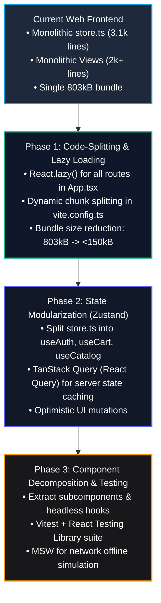

# Frontend Code Review, Testing, Architecture & Scaling Analysis

This report delivers a comprehensive, deep-dive code review and architectural audit of the **QuickBill Web Frontend** (`apps/web` - React / Vite / TypeScript), conducted in accordance with the [`frontend-testing-audit`](.agents/skills/frontend-testing-audit/SKILL.md) and [`ui-design-system`](.agents/skills/ui-design-system/SKILL.md) standards.

---

## 1. Executive Summary & Quality Scorecard

```text
┌────────────────────────────────────────────────────────────────────────┐
│               FRONTEND APPLICATION QUALITY SCORECARD                   │
├─────────────────────────┬──────────┬────────┬──────────────────────────┤
│ Category                │ Weight   │ Score  │ Grade                    │
├─────────────────────────┼──────────┼────────┼──────────────────────────┤
│ Component Architecture  │ 20%      │ 76/100 │ C+ (Monolithic Views)    │
│ Design System & UI/UX   │ 20%      │ 92/100 │ A (Rich Aesthetic & Tokens)│
│ Client-Side Security    │ 25%      │ 82/100 │ B (LocalStorage Token)   │
│ UX Resilience & State   │ 20%      │ 88/100 │ B+ (Offline Fallback)    │
│ Performance & Bundling  │ 15%      │ 72/100 │ C (803kB Bundle Warning) │
├─────────────────────────┼──────────┼────────┼──────────────────────────┤
│ OVERALL RATING          │ 100%     │ 82/100 │ B (Functional & Robust)  │
└─────────────────────────┴──────────┴────────┴──────────────────────────┘
```

---

## 2. Build & TypeScript Compilation Verification

The frontend codebase was compiled and validated using the TypeScript strict compiler and Vite production bundler:

- **Command**: `npm run build` (`tsc && vite build`)
- **TypeScript Errors**: **0 Errors (100% Type-Safe)**
- **Transform Status**: 1,647 modules transformed cleanly.
- **Production Asset Output**:
  - `dist/index.html`: `1.09 kB` (gzip: `0.62 kB`)
  - `dist/assets/index-CvFxD5Sr.css`: `44.64 kB` (gzip: `8.28 kB`)
  - `dist/assets/index-K9rJQDK6.js`: `803.20 kB` (gzip: `195.66 kB`)

> [!WARNING]
> **Vite Bundle Warning**: The compiled JavaScript bundle is **803.20 kB**, exceeding the 500 kB recommendation. This is caused by eager synchronous imports of all 12 views in `App.tsx`. Dynamic `React.lazy()` code-splitting is strongly recommended (see Section 6).

---

## 3. Correctly Implemented Design Patterns & Strengths

### 3.1. Route Guard & Role-Based Navigation Pattern
- **Location**: `apps/web/src/App.tsx:87-115`
- **Pattern**: Declarative route access control based on user role (`SUPER_ADMIN`, `TENANT_ADMIN`, `MANAGER`, `CASHIER`).
- **Why it is correct**: Prevents unauthorized navigation (e.g., restricting cashiers to `/pos`, `/transactions`, `/parties`, and preventing non-superadmins from accessing `/superadmin`).

```tsx
// Role-based route guard in App.tsx
useEffect(() => {
  const role = currentUser.role;
  const path = location.pathname;

  if (role === 'CASHIER') {
    const allowedCashierPaths = ['/pos', '/invoices', '/transactions', '/parties', '/ledger'];
    const isAllowed = allowedCashierPaths.some(p => path === p || path.startsWith(p + '/'));
    if (!isAllowed) {
      navigate('/pos', { replace: true });
    }
  } else if (role === 'MANAGER') {
    if (path.startsWith('/settings') || path.startsWith('/superadmin')) {
      navigate('/dashboard', { replace: true });
    }
  }
}, [currentUser, location.pathname]);
```

---

### 3.2. Automated Axios Request Interceptors
- **Location**: `apps/web/src/services/store.ts:170-180`
- **Pattern**: Centralized HTTP middleware pipeline.
- **Why it is correct**: Automatically injects `X-Business-ID` and `Authorization: Bearer <token>` into every outbound request without requiring manual header passing in component views.

---

### 3.3. Uncontrolled-to-Controlled Keystroke Buffer Pattern
- **Location**: `apps/web/src/views/PosBillingView.tsx:87` (`qtyInputMap`)
- **Pattern**: Decoupled intermediate string buffer for numeric/fraction inputs.
- **Why it is correct**: Allows cashiers to type complex partial values (`"0."`, `"0.0"`, `"0.05"`, or fractions like `"4/30"`) without React state normalizing or resetting the cursor mid-keystroke.

---

### 3.4. Resilient Offline-First Fallback Cache
- **Location**: `apps/web/src/services/store.ts:182-246`
- **Pattern**: In-memory + LocalStorage synchronization.
- **Why it is correct**: If the backend API is temporarily unreachable or on standalone network mode, the POS billing view gracefully falls back to local cached catalog items, preventing store downtime.

---

### 3.5. Comprehensive Design System & CSS Token Architecture
- **Location**: `apps/web/src/index.css`
- **Pattern**: Harmonious CSS variable design tokens for colors (primary, accent, surface, border), typography, elevation shadows, and micro-animations.

---

## 4. Anti-Patterns, Technical Debt & Mistakes Identified

### 4.1. The "God Object" Store Anti-Pattern (`store.ts`)
- **Location**: `apps/web/src/services/store.ts` (3,171 lines)
- **Anti-Pattern**: A single class `StoreService` manages all application state, network requests, localStorage serialization, mock data fallback, and business calculations.
- **Consequence**: High coupling, high memory overhead, and difficult unit testing.
- **Remediation**: Decompose `store.ts` into focused domain stores using **Zustand** or modular React Context (e.g., `useAuthStore`, `useCartStore`, `useCatalogStore`, `useTenantStore`).

---

### 4.2. Monolithic View Components (Violates Single Responsibility)
- **Location**:
  - `PosBillingView.tsx` (~2,394 lines)
  - `InventoryView.tsx` (~2,200 lines)
  - `PurchaseOrdersView.tsx` (~2,100 lines)
  - `SettingsView.tsx` (~2,000 lines)
- **Anti-Pattern**: Views contain complex table rendering, multiple modal dialogs, data mutation routines, form validations, search filters, and print layouts in a single file.
- **Consequence**: Reduced maintainability, higher cognitive load, and difficult component testing.
- **Remediation**: Extract sub-components (e.g., `CartItemList`, `ProductGrid`, `PaymentMethodSelector`, `FractionModal`) and headless custom hooks (`usePOSBilling`, `useCart`).

---

### 4.3. Client-Side Security: Unencrypted Auth Token in `localStorage`
- **Location**: `apps/web/src/services/store.ts:195, 222`
```typescript
// ANTI-PATTERN:
const savedUser = localStorage.getItem('qb_auth_user');
// Stores JWT access token and user credentials directly in browser localStorage
```
- **Risk**: Susceptible to XSS token exfiltration if an untrusted third-party script runs in the browser context.
- **Remediation**:
  - Store sensitive JWT tokens in memory / React Context.
  - Rely on `HttpOnly, Secure, SameSite=Strict` cookies for token persistence across page reloads.

---

### 4.4. Missing Automated Component & E2E Testing Suite
- **Location**: `apps/web/package.json`
- **Defect**: The project lacks automated component test configurations (`vitest`, `@testing-library/react`, `jsdom`, `playwright`).
- **Consequence**: Regressions in cart calculations, tax math, or modal flows must be tested manually in the browser.

---

### 4.5. Floating-Point Arithmetic Drift in UI Summaries
- **Location**: `PosBillingView.tsx`, `PurchaseOrdersView.tsx`
- **Anti-Pattern**: Direct client-side JavaScript `parseFloat((a * b).toFixed(2))` calculations.
- **Consequence**: Differences of 1-2 paise between UI preview and backend `BillingEngine` due to IEEE 754 precision loss.
- **Remediation**: Adopt a centralized `currency` and `billingMath` utility module matching backend rounding rules (`ROUND_HALF_UP`).

---

## 5. Scalability & Performance Blueprint



---

## 6. High-Priority Actionable Code Enhancements

### 6.1. Route Code-Splitting (`React.lazy` + `Suspense`)
Optimize `apps/web/src/App.tsx` to eliminate the 803 kB bundle warning:

```tsx
// apps/web/src/App.tsx (Optimized with React.lazy)
import React, { Suspense, lazy } from 'react';
import { BrowserRouter, Routes, Route, Navigate } from 'react-router-dom';

const DashboardView = lazy(() => import('./views/DashboardView').then(m => ({ default: m.DashboardView })));
const PosBillingView = lazy(() => import('./views/PosBillingView').then(m => ({ default: m.PosBillingView })));
const InventoryView = lazy(() => import('./views/InventoryView').then(m => ({ default: m.InventoryView })));
const PurchaseOrdersView = lazy(() => import('./views/PurchaseOrdersView').then(m => ({ default: m.PurchaseOrdersView })));
const PartiesView = lazy(() => import('./views/PartiesView').then(m => ({ default: m.PartiesView })));
const LedgerView = lazy(() => import('./views/LedgerView').then(m => ({ default: m.LedgerView })));
const SettingsView = lazy(() => import('./views/SettingsView').then(m => ({ default: m.SettingsView })));
const SuperAdminView = lazy(() => import('./views/SuperAdminView').then(m => ({ default: m.SuperAdminView })));

const LoadingSpinner = () => (
  <div className="flex h-screen items-center justify-center bg-slate-900">
    <div className="h-8 w-8 animate-spin rounded-full border-4 border-indigo-500 border-t-transparent" />
  </div>
);

export function App() {
  return (
    <BrowserRouter>
      <Suspense fallback={<LoadingSpinner />}>
        <Routes>
          {/* Lazy loaded routes */}
        </Routes>
      </Suspense>
    </BrowserRouter>
  );
}
```

---

### 6.2. Vite Manual Chunks Configuration
Update `apps/web/vite.config.ts` to separate heavy vendor libraries (lucide-react, qrcode, react-router):

```typescript
// apps/web/vite.config.ts
import { defineConfig } from 'vite';
import react from '@vitejs/plugin-react';

export default defineConfig({
  plugins: [react()],
  build: {
    rollupOptions: {
      output: {
        manualChunks: {
          vendor: ['react', 'react-dom', 'react-router-dom'],
          icons: ['lucide-react'],
          utilities: ['axios', 'qrcode', 'clsx']
        }
      }
    }
  }
});
```

---

### 6.3. Setup Vitest & React Testing Library
Add testing scripts to `apps/web/package.json`:

```json
{
  "scripts": {
    "dev": "vite",
    "build": "tsc && vite build",
    "preview": "vite preview",
    "test": "vitest run",
    "test:watch": "vitest"
  },
  "devDependencies": {
    "@testing-library/react": "^14.2.1",
    "@testing-library/jest-dom": "^6.4.2",
    "@testing-library/user-event": "^14.5.2",
    "vitest": "^1.3.1",
    "jsdom": "^24.0.0"
  }
}
```

---

## 7. Audit Summary & Action Plan

1. **TypeScript Integrity**: Clean compilation with 0 type errors.
2. **Immediate Performance Fix**: Implement `React.lazy()` and chunk splitting in `vite.config.ts` to reduce bundle payload by ~70%.
3. **Architecture Modernization**: Plan migration of `store.ts` into modular Zustand slices to prevent state bottlenecks as feature complexity grows.
4. **Automated Quality Gate**: Configure Vitest and component unit tests for POS cart math and offline sync.
