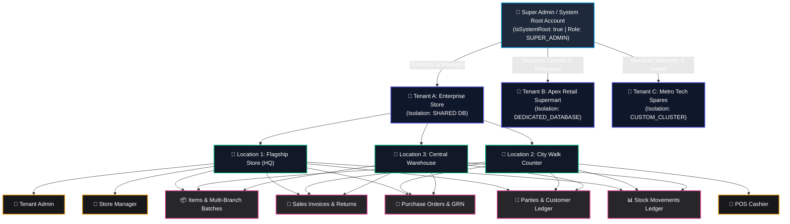
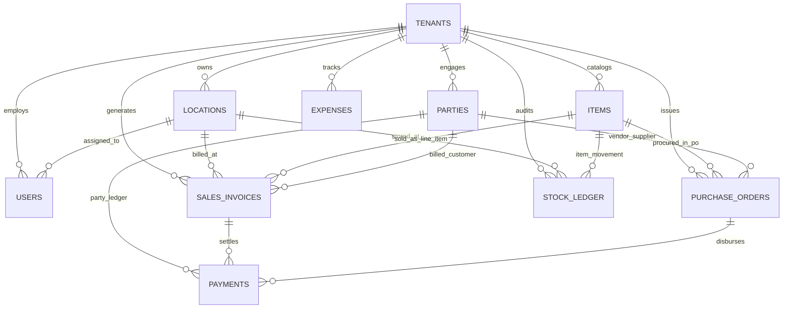

# MongoDB Schema, Multi-Tenant Hierarchy & System Integration Architecture

This document provides the authoritative, technical reference for all MongoDB schemas, multi-tenant connection orchestration, data models, and transactional integration workflows in the **QuickBill** platform.

---

## 1. Multi-Tenant Topology & Account Hierarchy

### 1.1. Hierarchy Architecture



---

### 1.2. How the Root Account Connects to Tenant Accounts

The application architecture utilizes a **hybrid multi-tenant database manager** (`MultiTenantDatabaseManager`) located in `apps/api/app/core/database.py`.

1. **System Primary Database (`quickbill_db`)**:
   - Stores the master `tenants` catalog, global `users`, and platform audit logs.
   - The Root / Super Administrator user (`isSystemRoot: true`) resides in the primary database with global privileges.
2. **Tenant Provisioning & Isolation Modes**:
   When the Super Admin onboards a new tenant, a database isolation strategy is defined:
   - **`SHARED` Mode**: Tenant data resides in the primary database collections, strictly segregated by mandatory `tenantId` / `businessId` query filters and compound tenant indexes.
   - **`DEDICATED_DATABASE` Mode**: The tenant receives an isolated MongoDB database (e.g., `quickbill_apex_db`) on the same MongoDB instance/cluster.
   - **`CUSTOM_CLUSTER` Mode**: The tenant connects to a dedicated external MongoDB replica set using an encrypted connection string (`mongodbUri`) with connection pooling.
3. **Dynamic Tenant Connection Resolution**:
   Whenever an authenticated API request arrives:
   - The user's JWT payload is validated, extracting `default_business_id` and `authorized_business_ids`.
   - If a Super Admin passes an `X-Tenant-ID` header (or performs context switching), the `get_tenant_db(business_id)` resolver inspects the tenant's `databaseConfig`.
   - The appropriate connection pool or database instance is dynamically resolved and injected into the request lifecycle.

```python
# Dynamic Database Resolution Pattern
async def get_tenant_database(self, business_id: str) -> AsyncIOMotorDatabase:
    primary = self.get_primary_database()
    tenant = await primary.tenants.find_one({"_id": ObjectId(business_id)})
    
    if not tenant:
        return primary
    
    if tenant.get("status") == "SUSPENDED":
        raise HTTPException(status_code=403, detail="Tenant account is suspended.")

    db_config = tenant.get("databaseConfig", {})
    isolation_mode = db_config.get("isolationMode", "SHARED")
    
    if isolation_mode == "CUSTOM_CLUSTER":
        uri = db_config.get("mongodbUri")
        if uri not in self._custom_clients:
            self._custom_clients[uri] = AsyncIOMotorClient(uri, maxPoolSize=20)
        return self._custom_clients[uri][db_config.get("databaseName")]
    elif isolation_mode == "DEDICATED_DATABASE":
        return self.primary_client[db_config.get("databaseName")]
    
    return self.primary_client[settings.DATABASE_NAME]
```

---

## 2. Complete MongoDB Schema Specifications

### 2.1. System & Authentication Collections

#### `tenants` Collection
Stores tenant registrations, database routing configs, subscription tiers, and company profiles.

```json
{
  "_id": { "$oid": "65f2a1b9a000000000000001" },
  "name": "QuickBill Enterprise Main Store",
  "slug": "main-store-01",
  "plan": "ENTERPRISE",
  "status": "ACTIVE",
  "gstin": "27AAPFU0939F1ZV",
  "phone": "+91 9876543210",
  "email": "owner@quickbill-store.com",
  "address": {
    "street": "100 Commercial Boulevard",
    "city": "Mumbai",
    "state": "Maharashtra",
    "postalCode": "400001",
    "country": "India"
  },
  "databaseConfig": {
    "isolationMode": "SHARED",
    "mongodbUri": null,
    "databaseName": "quickbill_db"
  },
  "settings": {
    "currency": "INR",
    "currencySymbol": "₹",
    "enableRoundOff": true,
    "defaultTaxRate": 18.0,
    "allowNegativeStock": false,
    "enableBatchTracking": true
  },
  "createdAt": { "$date": "2026-01-15T10:00:00.000Z" },
  "updatedAt": { "$date": "2026-03-20T14:22:00.000Z" }
}
```

---

#### `users` Collection
Stores platform-wide administrators, tenant store owners, managers, and cashiers.

```json
{
  "_id": { "$oid": "65f2a1b9a000000000000010" },
  "email": "manager@store.com",
  "name": "Sarah Jenkins",
  "passwordHash": "$argon2id$v=19$m=65536,t=3,p=4$...",
  "tenantId": { "$oid": "65f2a1b9a000000000000001" },
  "authorizedTenantIds": [
    { "$oid": "65f2a1b9a000000000000001" },
    { "$oid": "65f2a1b9a000000000000002" }
  ],
  "roles": ["MANAGER"],
  "assignedLocationIds": [
    { "$oid": "65f2a1b9a000000000000101" },
    { "$oid": "65f2a1b9a000000000000102" }
  ],
  "isSystemRoot": false,
  "isActive": true,
  "createdAt": { "$date": "2026-02-01T08:00:00.000Z" },
  "updatedAt": { "$date": "2026-03-10T12:00:00.000Z" }
}
```

---

#### `locations` (Branches & Warehouses) Collection
Supports multi-store topologies, separate billing counters, and supply warehouses.

```json
{
  "_id": { "$oid": "65f2a1b9a000000000000101" },
  "businessId": { "$oid": "65f2a1b9a000000000000001" },
  "name": "Main Flagship Counter",
  "code": "MAIN-01",
  "address": "Ground Floor, Metro Retail Plaza, Sector 18",
  "phone": "+91 9876543210",
  "isDefault": true,
  "isActive": true,
  "createdAt": { "$date": "2026-01-15T10:00:00.000Z" },
  "updatedAt": { "$date": "2026-01-15T10:00:00.000Z" }
}
```

---

### 2.2. Master Data & Inventory Collections

#### `items` (Products & Master Catalogue) Collection
Tracks SKU, barcode, category, unit, multi-branch inventory overrides, and purchase batches.

```json
{
  "_id": { "$oid": "65f2a1b9a000000000000201" },
  "businessId": { "$oid": "65f2a1b9a000000000000001" },
  "name": "Organic Basmati Rice (1kg)",
  "sku": "RIC-BAS-001",
  "barcode": "8901030384721",
  "categoryId": { "$oid": "65f2a1b9a000000000000301" },
  "category": "Grains & Pulses",
  "unit": "kg",
  "allowParts": true,
  "purchasePrice": { "$numberDecimal": "85.00" },
  "averageCostPrice": { "$numberDecimal": "82.50" },
  "salePrice": { "$numberDecimal": "120.00" },
  "mrp": { "$numberDecimal": "140.00" },
  "taxRate": { "$numberDecimal": "5.00" },
  "minStockAlert": { "$numberDecimal": "10.0" },
  "currentStock": { "$numberDecimal": "145.5" },
  "openingStock": { "$numberDecimal": "50.0" },
  "hasDiscount": true,
  "discountType": "PERCENT",
  "discountValue": { "$numberDecimal": "5.0" },
  "locations": [
    {
      "locationId": "65f2a1b9a000000000000101",
      "locationName": "Main Flagship Counter",
      "salePrice": { "$numberDecimal": "120.00" },
      "purchasePrice": { "$numberDecimal": "85.00" },
      "mrp": { "$numberDecimal": "140.00" },
      "currentStock": { "$numberDecimal": "45.5" },
      "minStockAlert": { "$numberDecimal": "10.0" },
      "isListed": true,
      "hasDiscount": true,
      "discountType": "PERCENT",
      "discountValue": { "$numberDecimal": "5.0" }
    },
    {
      "locationId": "65f2a1b9a000000000000103",
      "locationName": "Central Supply Warehouse",
      "salePrice": { "$numberDecimal": "115.00" },
      "purchasePrice": { "$numberDecimal": "80.00" },
      "mrp": { "$numberDecimal": "140.00" },
      "currentStock": { "$numberDecimal": "100.0" },
      "minStockAlert": { "$numberDecimal": "20.0" },
      "isListed": true,
      "hasDiscount": false,
      "discountType": "PERCENT",
      "discountValue": { "$numberDecimal": "0.0" }
    }
  ],
  "batches": [
    {
      "batchId": "BAT-202603-01",
      "batchNumber": "LOT-8842",
      "purchaseOrderId": "65f2a1b9a000000000000401",
      "purchaseOrderNumber": "PO-2026-0012",
      "supplierId": "65f2a1b9a000000000000501",
      "supplierName": "Agro Agro Super Farms Ltd",
      "locationId": "65f2a1b9a000000000000101",
      "purchasePrice": { "$numberDecimal": "80.00" },
      "salePrice": { "$numberDecimal": "120.00" },
      "mrp": { "$numberDecimal": "140.00" },
      "currentStock": { "$numberDecimal": "45.5" },
      "receivedDate": "2026-03-01T10:00:00Z"
    }
  ],
  "images": [
    {
      "id": "img_01",
      "url": "https://cdn.quickbill.app/uploads/items/rice_01.webp",
      "isPrimary": true,
      "order": 0
    }
  ],
  "isActive": true,
  "createdAt": { "$date": "2026-01-20T10:00:00.000Z" },
  "updatedAt": { "$date": "2026-03-22T11:45:00.000Z" }
}
```

---

#### `parties` (Customers & Suppliers) Collection
Unified ledger party collection for both B2B/B2C Customers and Vendors.

```json
{
  "_id": { "$oid": "65f2a1b9a000000000000501" },
  "businessId": { "$oid": "65f2a1b9a000000000000001" },
  "name": "Agro Super Farms Ltd",
  "partyType": "SUPPLIER",
  "phone": "+91 9822334455",
  "email": "billing@agrosuperfarms.com",
  "gstin": "27AAACA1234A1Z5",
  "creditPeriodDays": 30,
  "creditLimit": { "$numberDecimal": "500000.00" },
  "openingBalance": { "$numberDecimal": "0.00" },
  "currentBalance": { "$numberDecimal": "45000.00" },
  "balanceType": "PAYABLE",
  "address": {
    "street": "Gat 44, National Highway 4",
    "city": "Pune",
    "state": "Maharashtra",
    "postalCode": "411028"
  },
  "isActive": true,
  "createdAt": { "$date": "2026-01-22T14:00:00.000Z" },
  "updatedAt": { "$date": "2026-03-18T16:30:00.000Z" }
}
```

---

### 2.3. Transactions & Financial Collections

#### `sales_invoices` Collection
Point-of-Sale bills and credit invoices with immutable snapshots and returns tracking.

```json
{
  "_id": { "$oid": "65f2a1b9a000000000000601" },
  "businessId": { "$oid": "65f2a1b9a000000000000001" },
  "invoiceNumber": "INV-2026-00084",
  "invoiceDate": { "$date": "2026-03-25T14:30:00.000Z" },
  "partyId": { "$oid": "65f2a1b9a000000000000502" },
  "consumerName": "Rajesh Sharma",
  "consumerPhone": "+91 9820011223",
  "locationId": "65f2a1b9a000000000000101",
  "locationName": "Main Flagship Counter",
  "locationCode": "MAIN-01",
  "billedById": "65f2a1b9a000000000000010",
  "billedByName": "Sarah Jenkins",
  "billedByRole": "MANAGER",
  "items": [
    {
      "itemId": "65f2a1b9a000000000000201",
      "nameSnapshot": "Organic Basmati Rice (1kg)",
      "skuSnapshot": "RIC-BAS-001",
      "quantity": { "$numberDecimal": "2.5" },
      "returnedQuantity": { "$numberDecimal": "0.0" },
      "returnStatus": "NONE",
      "unitPrice": { "$numberDecimal": "120.00" },
      "discount": { "$numberDecimal": "15.00" },
      "taxableAmount": { "$numberDecimal": "285.00" },
      "taxRate": { "$numberDecimal": "5.00" },
      "taxAmount": { "$numberDecimal": "14.25" },
      "lineTotal": { "$numberDecimal": "299.25" }
    }
  ],
  "subtotal": { "$numberDecimal": "285.00" },
  "taxTotal": { "$numberDecimal": "14.25" },
  "invoiceDiscount": { "$numberDecimal": "0.00" },
  "additionalCharges": { "$numberDecimal": "0.00" },
  "roundOff": { "$numberDecimal": "0.75" },
  "grandTotal": { "$numberDecimal": "300.00" },
  "paidAmount": { "$numberDecimal": "300.00" },
  "balanceAmount": { "$numberDecimal": "0.00" },
  "paymentStatus": "PAID",
  "paymentMode": "UPI",
  "paymentReference": "UPI-REF-99281203",
  "status": "COMPLETED",
  "createdAt": { "$date": "2026-03-25T14:30:00.000Z" }
}
```

---

#### `purchase_orders` Collection
Procurement workflow tracking orders, vendor receipts, and balance accounts payable.

```json
{
  "_id": { "$oid": "65f2a1b9a000000000000401" },
  "businessId": { "$oid": "65f2a1b9a000000000000001" },
  "poNumber": "PO-2026-0012",
  "supplierId": "65f2a1b9a000000000000501",
  "supplierName": "Agro Super Farms Ltd",
  "orderDate": { "$date": "2026-03-01T09:00:00.000Z" },
  "expectedDate": { "$date": "2026-03-05T18:00:00.000Z" },
  "status": "RECEIVED",
  "items": [
    {
      "itemId": "65f2a1b9a000000000000201",
      "itemName": "Organic Basmati Rice (1kg)",
      "sku": "RIC-BAS-001",
      "unit": "kg",
      "orderedQuantity": 100.0,
      "receivedQuantity": 100.0,
      "unitCost": 80.0,
      "taxRate": 5.0,
      "totalCost": 8400.0
    }
  ],
  "receipts": [
    {
      "receiptNumber": "GRN-2026-0004",
      "receiptDate": { "$date": "2026-03-01T10:00:00.000Z" },
      "receivedBy": "Sarah Jenkins",
      "locationId": "65f2a1b9a000000000000101",
      "items": [
        {
          "itemId": "65f2a1b9a000000000000201",
          "quantityReceived": 100.0,
          "unitCost": 80.0
        }
      ]
    }
  ],
  "subtotal": 8000.0,
  "taxAmount": 400.0,
  "totalAmount": 8400.0,
  "paidAmount": 8400.0,
  "balanceAmount": 0.0,
  "paymentStatus": "PAID",
  "payments": [
    {
      "paymentDate": { "$date": "2026-03-01T11:00:00.000Z" },
      "amountPaid": 8400.0,
      "paymentMode": "BANK_TRANSFER",
      "referenceNumber": "NEFT-781928391"
    }
  ],
  "createdAt": { "$date": "2026-03-01T09:00:00.000Z" }
}
```

---

#### `stock_ledger` Collection
The single source of truth for stock movement auditing.

```json
{
  "_id": { "$oid": "65f2a1b9a000000000000701" },
  "businessId": { "$oid": "65f2a1b9a000000000000001" },
  "itemId": { "$oid": "65f2a1b9a000000000000201" },
  "locationId": "65f2a1b9a000000000000101",
  "movementType": "SALE",
  "quantity": { "$numberDecimal": "-2.5" },
  "balanceAfter": { "$numberDecimal": "45.5" },
  "unitCost": { "$numberDecimal": "80.00" },
  "referenceType": "SALES_INVOICE",
  "referenceId": "INV-2026-00084",
  "referenceObjectId": { "$oid": "65f2a1b9a000000000000601" },
  "batchNumber": "LOT-8842",
  "userId": { "$oid": "65f2a1b9a000000000000010" },
  "notes": "Point-of-Sale checkout",
  "createdAt": { "$date": "2026-03-25T14:30:00.000Z" }
}
```

---

#### `payments` & `expenses` Collections

**`payments` Document:**
```json
{
  "_id": { "$oid": "65f2a1b9a000000000000801" },
  "businessId": { "$oid": "65f2a1b9a000000000000001" },
  "voucherNumber": "PAY-2026-0045",
  "paymentType": "PAYMENT_IN",
  "partyId": { "$oid": "65f2a1b9a000000000000502" },
  "amount": { "$numberDecimal": "300.00" },
  "paymentMode": "UPI",
  "referenceNumber": "UPI-REF-99281203",
  "invoiceId": { "$oid": "65f2a1b9a000000000000601" },
  "locationId": "65f2a1b9a000000000000101",
  "receivedById": "65f2a1b9a000000000000010",
  "createdAt": { "$date": "2026-03-25T14:30:00.000Z" }
}
```

**`expenses` Document:**
```json
{
  "_id": { "$oid": "65f2a1b9a000000000000901" },
  "businessId": { "$oid": "65f2a1b9a000000000000001" },
  "expenseNumber": "EXP-2026-0019",
  "category": "Electricity & Utilities",
  "amount": { "$numberDecimal": "4250.00" },
  "paymentMode": "BANK_TRANSFER",
  "locationId": "65f2a1b9a000000000000101",
  "paidTo": "Maharashtra State Electricity Distribution",
  "receiptUrl": "https://cdn.quickbill.app/uploads/receipts/bill_march.pdf",
  "notes": "Store counter power bill for March 2026",
  "createdAt": { "$date": "2026-03-20T11:00:00.000Z" }
}
```

---

## 3. Entity-Relationship & Schema Integration Map



---

## 4. Cross-Service Transactional Workflows (ACID Guarantees)

### 4.1. Point-of-Sale (POS) Checkout Transaction

```mermaid
sequenceDiagram
    autonumber
    actor Cashier as 👤 POS Cashier
    participant API as 🚀 FastAPI /sales Router
    participant Engine as 🧮 BillingEngine
    participant Session as 🔒 MongoDB ACID Session
    participant DB as 🗄️ MongoDB Collections

    Cashier->>API: POST /api/v1/sales (Cart items, locationId, payment)
    API->>Engine: calculate_invoice(items, taxRates, discounts)
    Engine-->>API: Verified totals & line snapshots
    API->>Session: client.start_session()
    
    rect rgb(20, 30, 40)
        Note over Session,DB: ACID Multi-Document Transaction Boundary
        API->>DB: 1. Insert sales_invoices record
        API->>DB: 2. Insert stock_ledger (DECREMENT)
        API->>DB: 3. Update items (decrement currentStock & location stock)
        API->>DB: 4. If credit, update parties.currentBalance (+Receivable)
        API->>DB: 5. If paid, insert payments voucher
        Session->>DB: session.commit_transaction()
    end

    DB-->>API: Commit Success
    API-->>Cashier: 201 Created (SaleResponse with Invoice QR)
```



---

### 4.2. Goods Receipt Note (GRN) & Item Cost Averaging

When a Purchase Order is received:
1. **Stock Movement**: `stock_ledger` records an increment movement (`MOVEMENT_PURCHASE`).
2. **Batch Generation**: A new entry is appended to `items.batches` with `batchNumber`, `purchasePrice`, and `supplierId`.
3. **Moving Weighted Average Cost (WAC)** calculation:
   $$\text{New Average Cost} = \frac{(\text{Current Stock} \times \text{Old Avg Cost}) + (\text{Received Qty} \times \text{New Unit Cost})}{\text{Current Stock} + \text{Received Qty}}$$
4. **Accounts Payable**: `parties.currentBalance` increases by the unpaid invoice balance.

---

## 5. Mandatory Indexing & Performance Strategy

| Collection | Required Compound Index | Purpose |
|---|---|---|
| `users` | `{ email: 1 }` (Unique)<br>`{ tenantId: 1, roles: 1 }` | Fast authentication & store staff lookup |
| `items` | `{ businessId: 1, sku: 1 }` (Unique)<br>`{ businessId: 1, barcode: 1 }`<br>`{ businessId: 1, name: "text" }` | Multi-tenant SKU uniqueness & fast POS barcode scans |
| `locations` | `{ businessId: 1, code: 1 }` (Unique) | Branch code uniqueness per tenant |
| `sales_invoices` | `{ businessId: 1, invoiceNumber: 1 }` (Unique)<br>`{ businessId: 1, invoiceDate: -1 }`<br>`{ businessId: 1, locationId: 1, paymentStatus: 1 }` | Fast reporting & daily register lookups |
| `purchase_orders` | `{ businessId: 1, poNumber: 1 }` (Unique)<br>`{ businessId: 1, status: 1 }` | Procurement state tracking |
| `stock_ledger` | `{ businessId: 1, itemId: 1, createdAt: -1 }`<br>`{ businessId: 1, referenceId: 1 }` | Real-time stock calculation & audit history |
| `parties` | `{ businessId: 1, phone: 1 }`<br>`{ businessId: 1, partyType: 1, currentBalance: -1 }` | Customer phone search & overdue receivables |

---

## 6. Security, Zero-Float & Tenancy Integrity Rules

1. **Mandatory Tenant Prefix**: Every single database query, projection, and aggregation stage MUST prefix `{ businessId: tenant_id }`.
2. **Zero-Float Policy**: All monetary amounts (`salePrice`, `unitCost`, `taxAmount`, `grandTotal`, `currentBalance`) and fractional quantities are stored as `Decimal128` (BSON type 19) or integer cents.
3. **Session-Level Isolation**: Root administrator cross-tenant queries must always specify tenant context explicitly to prevent data contamination across isolated tenant clusters.
