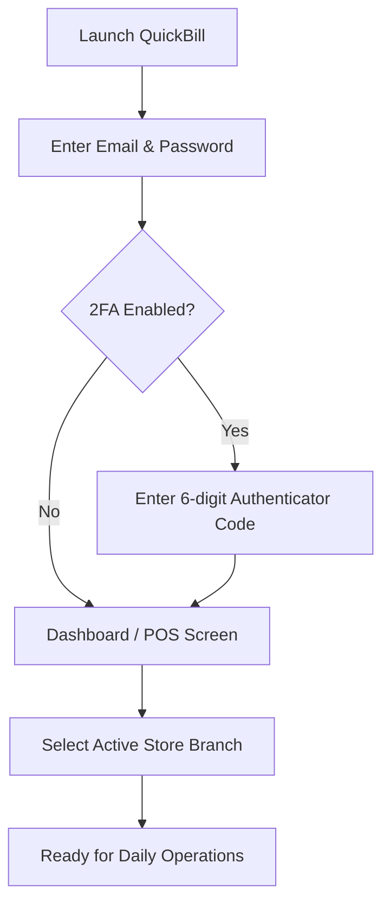

# 📖 QuickBill & Inventory Management — Complete End-User Manual

> **The definitive operational guide for Store Owners, Cashiers, Inventory Managers, and Accountants.**

---

## 📑 Table of Contents

1. [Introduction & System Overview](#1-introduction--system-overview)
2. [Getting Started & Account Security](#2-getting-started--account-security)
   - [Logging In & Branch Selection](#logging-in--branch-selection)
   - [Two-Factor Authentication (2FA / TOTP)](#two-factor-authentication-2fa--totp)
   - [Store & Branch Profile Customization](#store--branch-profile-customization)
3. [Point of Sale (POS) Billing Operations](#3-point-of-sale-pos-billing-operations)
   - [POS Interface Walkthrough](#pos-interface-walkthrough)
   - [Adding Products (Search, Categories & Barcode Scanning)](#adding-products-search-categories--barcode-scanning)
   - [Understanding Tax-Inclusive Pricing & Tax Breakdown](#understanding-tax-inclusive-pricing--tax-breakdown)
   - [Discounts (Line-Item & Bill-Level)](#discounts-line-item--bill-level)
   - [Holding / Staging Carts (Parked Orders)](#holding--staging-carts-parked-orders)
   - [Payment Processing (Cash, UPI/QR, Card, Split & Customer Credit)](#payment-processing-cash-upiqr-card-split--customer-credit)
   - [Printing Thermal Receipts & WhatsApp Sharing](#printing-thermal-receipts--whatsapp-sharing)
4. [Inventory & Stock Management](#4-inventory--stock-management)
   - [Item Catalog & Product Master](#item-catalog--product-master)
   - [Multi-Branch Stock Visibility](#multi-branch-stock-visibility)
   - [Stock Adjustments (Restock, Damage, Loss & Physical Count)](#stock-adjustments-restock-damage-loss--physical-count)
   - [Barcode & Shipping Label Generation & Printing](#barcode--shipping-label-generation--printing)
   - [Low-Stock Alerts](#low-stock-alerts)
5. [Invoices & Sales Returns](#5-invoices--sales-returns)
   - [Searching & Filtering Invoices](#searching--filtering-invoices)
   - [Processing Full & Partial Sales Returns](#processing-full--partial-sales-returns)
   - [Restockable vs. Defective / Damaged Item Handling](#restockable-vs-defective--damaged-item-handling)
6. [Suppliers & Purchase Management](#6-suppliers--purchase-management)
   - [Creating Purchase Orders](#creating-purchase-orders)
   - [Receiving Stock & Updating Inventory](#receiving-stock--updating-inventory)
   - [Tracking Supplier Payables](#tracking-supplier-payables)
7. [Parties & Credit Ledger (Customer Khata)](#7-parties--credit-ledger-customer-khata)
   - [Managing Customer Profiles & Credit Limits](#managing-customer-profiles--credit-limits)
   - [Recording Payments In & Payments Out](#recording-payments-in--payments-out)
   - [Viewing Account Statements & Ledgers](#viewing-account-statements--ledgers)
8. [Reports, Profit & Loss, and GST Compliance](#8-reports-profit--loss-and-gst-compliance)
   - [Daily Day Book & Sales Turnover](#daily-day-book--sales-turnover)
   - [Trading & Profit & Loss Statement (Real COGS Analysis)](#trading--profit--loss-statement-real-cogs-analysis)
   - [GSTR-1 GST Rate Slab Breakdown (0%, 5%, 12%, 18%, 28%)](#gstr-1-gst-rate-slab-breakdown-0-5-12-18-28)
   - [Stock Valuation Reports](#stock-valuation-reports)
   - [Exporting Reports for Accountants (CSV / PDF)](#exporting-reports-for-accountants-csv--pdf)
9. [User Roles & Permissions](#9-user-roles--permissions)
10. [Keyboard Shortcuts & Quick Cheatsheet](#10-keyboard-shortcuts--quick-cheatsheet)
11. [Troubleshooting & Frequently Asked Questions (FAQ)](#11-troubleshooting--frequently-asked-questions-faq)

---

## 1. Introduction & System Overview

QuickBill is a modern, high-speed Point-of-Sale (POS), inventory management, and business accounting application. It is engineered for retail shops, wholesale distributors, multi-store franchises, and grocery chains.

### 🌟 Key Highlights
- **Sub-15 Second Checkout**: Fast search, category filtering, barcode scanner support, and instant calculation.
- **Tax-Inclusive Pricing**: Product shelf prices automatically back-calculate taxable base and output GST without double tax deductions.
- **Location-Scoped Inventory**: Each store branch maintains its own stock levels while sharing the global item catalog.
- **Immutable Stock Ledger**: Every sale, return, purchase, and manual adjustment is tracked with timestamps, reasons, and location IDs.
- **Automated Sales Returns**: Returned goods are logged with reason tags (Restockable vs. Defective) and automatically restocked into inventory when eligible.
- **Two-Factor Authentication (2FA)**: Enterprise-grade TOTP security to protect financial reports and store settings.

---

## 2. Getting Started & Account Security



### Logging In & Branch Selection
1. Open the QuickBill application in your web browser (e.g., `http://localhost:3000`) or launch the mobile app.
2. Enter your **Email** and **Password**.
3. Upon logging in, select your active **Store Location / Branch** from the top-right header dropdown.
4. All transactions, billing entries, and stock views will automatically scope to your active branch.

### Two-Factor Authentication (2FA / TOTP)
To secure your account against unauthorized access:
1. Navigate to **Settings** ⚙️ $\rightarrow$ **Security**.
2. Click **Enable Two-Factor Authentication**.
3. Scan the displayed QR code using Google Authenticator, Microsoft Authenticator, or Authy.
4. Enter the 6-digit verification code to confirm setup.
5. Save your backup recovery codes in a secure location.

### Store & Branch Profile Customization
You can customize branding for each store branch:
- **Store Name & Branch Name**: Displayed on all printed receipts and invoices.
- **GSTIN**: Location-specific GST registration number.
- **Store Code**: Short identifier (e.g., `NYC-01`, `MUM-HQ`).
- **Address & Phone**: Contact details printed in the receipt header.
- **Thermal Receipt Footer**: Custom message (e.g., *"Thank you for shopping with us! No refund without bill."*).

---

## 3. Point of Sale (POS) Billing Operations

```
┌─────────────────────────────────────────────────────────────────────────────┐
│  [🔍 Search Product (F2)] [📁 Categories ▾] [📷 Barcode Scanner]   [Store: Main] │
├───────────────────────────────────────────────────────┬─────────────────────┤
│  PRODUCT CATALOG                                      │ CURRENT CART        │
│  ┌──────────────┐ ┌──────────────┐ ┌──────────────┐   │ Walk-In Customer    │
│  │ Premium Tea  │ │ Basmati Rice │ │ Cold Coffee  │   │ ─────────────────── │
│  │ ₹150.00      │ │ ₹110.00      │ │ ₹85.00       │   │ 1x Tea       ₹150.0 │
│  │ Stock: 42    │ │ Stock: 18    │ │ Stock: 05    │   │ 2x Coffee    ₹170.0 │
│  └──────────────┘ └──────────────┘ └──────────────┘   │ ─────────────────── │
│                                                       │ Subtotal:    ₹271.19│
│  [📥 Park Cart (F8)]  [📑 Held Carts (2)]             │ GST (18%):   ₹ 48.81│
│                                                       │ TOTAL:       ₹320.00│
│                                                       │ [ 💳 PAY NOW (F9) ] │
└───────────────────────────────────────────────────────┴─────────────────────┘
```

### POS Interface Walkthrough
The POS interface is split into two primary areas:
1. **Left Panel (Product Catalog & Fast Actions)**: Real-time search, category dropdown popover, product cards with instant stock indicators, barcode scanner input, and parked cart controls.
2. **Right Panel (Cart & Checkout)**: Customer selection, line items with quantity adjusters, discount toggles, tax breakdown, and payment trigger buttons.

### Adding Products (Search, Categories & Barcode Scanning)
You can add items to the cart using three methods:
- **Barcode / QR Scanner**: Scan any product barcode or QuickBill QR label (`ITEM:<publicItemId>`). The item is automatically added to the cart or its quantity is incremented by 1.
- **Instant Search Bar**: Press `F2` or click the search box. Type product name, SKU, or public ID.
- **Category Filter**: Click the **Categories** dropdown to filter products (e.g., Groceries, Beverages, Electronics).

### Understanding Tax-Inclusive Pricing & Tax Breakdown
In QuickBill, product selling prices are **tax-inclusive** (MRP / Retail rate includes GST):
- Example: An item priced at **₹100.00** with **18% GST**:
  - Taxable Base Amount: $\frac{100}{1 + 0.18} = ₹84.75$
  - Output GST (18%): $₹100.00 - ₹84.75 = ₹15.25$ (Split into ₹7.62 CGST + ₹7.62 SGST)
  - Total Billed to Customer: **₹100.00**
- *Note:* Output GST is clearly separated in reports and receipts without deducting it twice from your revenue totals.

### Discounts (Line-Item & Bill-Level)
- **Line-Item Discount**: Click on any cart item to apply a percentage (%) or flat amount (₹) discount to that specific product.
- **Bill-Level Discount**: Apply an overall discount to the entire invoice from the checkout summary.

### Holding / Staging Carts (Parked Orders)
When a customer needs to fetch an extra item while in line:
1. Click **Hold Cart** or press `F8`.
2. The cart is saved to the local workspace and synchronized with the backend.
3. You can serve the next customer immediately.
4. To resume: Click **Held Carts** on the top bar, select the staged order, and click **Resume**.
5. To discard: Click the **Discard (Trash)** icon and confirm the confirmation prompt.

### Payment Processing
Click **Pay Now** or press `F9` to open the payment modal:
- **Cash**: Enter received amount; the system calculates exact change to return.
- **UPI / Dynamic QR**: Generates an instant UPI QR code for the customer to scan and pay from GPay/PhonePe/Paytm.
- **Card**: Accepts debit/credit card payments and records the reference code.
- **Customer Credit (Khata)**: Charges the bill to the customer's running balance ledger (subject to credit limit).
- **Split Payment**: Combine multiple modes (e.g., ₹500 Cash + ₹750 UPI).

### Printing Thermal Receipts & WhatsApp Sharing
Upon invoice creation:
- **Thermal POS Print (2-inch / 3-inch)**: One-click print formatted directly for thermal receipt printers (ESC/POS compatible).
- **A4 PDF Invoice**: Standard tax invoice layout for corporate and wholesale buyers.
- **WhatsApp Share**: Sends an instant digital invoice summary with download link directly to the customer's WhatsApp.

---

## 4. Inventory & Stock Management

```
┌─────────────────────────────────────────────────────────────────────────────┐
│  ITEM MASTER & INVENTORY TRACKING                                           │
├────────────┬──────────────────┬──────────┬─────────────┬──────────┬─────────┤
│ Item Code  │ Name             │ Category │ Purchase ₹  │ Selling ₹│ Stock   │
├────────────┼──────────────────┼──────────┼─────────────┼──────────┼─────────┤
│ ITM-00102  │ Basmati Rice 5kg │ Grocery  │ ₹ 450.00    │ ₹ 600.00 │ 24 bags │
│ ITM-00103  │ Olive Oil 1L     │ Grocery  │ ₹ 720.00    │ ₹ 950.00 │ 08 btls │
│ ITM-00104  │ USB-C Cable      │ Cable    │ ₹  80.00    │ ₹ 199.00 │ 02 (LOW)│
└────────────┴──────────────────┴──────────┴─────────────┴──────────┴─────────┘
```

### Item Catalog & Product Master
Under **Inventory** $\rightarrow$ **Items**:
- Add new items with Name, SKU, Barcode, Public Item ID, Category, Unit (Pcs, Kg, Ltr, Box), HSN Code, Tax Rate (0%, 5%, 12%, 18%, 28%), Purchase Price, and Selling Price.
- Set **Minimum Stock Alert Threshold** to receive low-stock notifications.

### Multi-Branch Stock Visibility
- The inventory table dynamically reflects the available physical stock at your **currently selected location**.
- Switching branches immediately updates stock quantities to match the selected store's warehouse.

### Stock Adjustments
For inventory reconciliation, damages, or stock corrections:
1. Open the item details and click **Adjust Stock**.
2. Select the adjustment reason:
   - **Restock / Inward**: Adds inventory received outside standard purchase orders.
   - **Damage / Expired**: Deducts damaged or expired goods from stock and logs a loss entry.
   - **Lost / Missing**: Deducts unaccounted inventory discrepancy.
   - **Physical Count Audit**: Replaces stock level with actual physical count.
3. Enter notes and confirm. The stock movement ledger is updated immutably.

### Barcode & Shipping Label Generation
1. Navigate to **Inventory** $\rightarrow$ **Label Generator**.
2. Select product(s) and specify quantity of labels to print.
3. Choose label template:
   - Standard Product Tag (Barcode + Name + MRP + Packed Date)
   - QR Label (`ITEM:<publicItemId>`)
   - Shipping Address Label
4. Click **Print Labels** to print directly to a barcode sticker printer (Zebra, TSC, TVS) or standard A4 sticker sheet.

---

## 5. Invoices & Sales Returns

### Searching & Filtering Invoices
Under **Sales** $\rightarrow$ **Invoices**:
- Filter invoices by Date Range, Status (Paid, Partial, Unpaid, Cancelled, Returned), Payment Mode, or Customer Name.
- View detailed invoice snapshots, payment breakdown, and print history.

### Processing Full & Partial Sales Returns
QuickBill allows returning items with strict audit tracking:
1. Open the original invoice from the Invoices list.
2. Click **Return Items / Create Credit Note**.
3. Select which items and quantities the customer is returning.
4. Select the return reason:
   - **Restockable Return**: Good condition; item is automatically added back to current location inventory.
   - **Defective / Damaged**: Damaged condition; item is logged as defective and excluded from sellable stock.
   - **Exchange**: Replaced with another product.
   - **Wrong Item**: Sent or billed incorrectly.
5. Choose refund method (Cash refund, UPI refund, or Credit balance to customer Khata).
6. Confirm return. The invoice status updates to `PARTIAL_RETURN` or `RETURNED`, and the inventory ledger updates automatically.

---

## 6. Suppliers & Purchase Management

1. **Create Purchase Orders**: Enter supplier details, items, purchase rates, and tax rates.
2. **Receive Goods**: Mark purchase order as received to automatically increment inventory at the receiving branch.
3. **Record Payments Out**: Track partial or full payments made to suppliers via Bank Transfer, Cheque, or Cash.

---

## 7. Parties & Credit Ledger (Customer Khata)


### Managing Customer Profiles & Credit Limits
- Add customer details: Name, Mobile, Email, GSTIN, Billing Address, and **Credit Limit**.
- Prevent overdue accounts by setting strict credit limits at POS checkout.

### Recording Payments In & Payments Out
- **Payment In**: Record money received from a customer against outstanding invoices or as advance credit.
- **Payment Out**: Record payments made to vendors/suppliers.

### Account Statements & Ledgers
- View complete transactional timeline for any party: Invoices, Returns, Payments, and running balance.
- Download or share Party Ledger statements via WhatsApp or PDF.

---

## 8. Reports, Profit & Loss, and GST Compliance

```
┌─────────────────────────────────────────────────────────────────────────────┐
│  TRADING & PROFIT / LOSS STATEMENT                                          │
├─────────────────────────────────────────────────────────────────────────────┤
│  Gross Billed Sales (Customer Invoices, Tax-Inclusive):        ₹ 4,50,000.00 │
│  Less: GST Output Tax Collected (CGST + SGST):              - ₹   68,644.07 │
│  Less: Sales Returns & Allowances:                          - ₹    8,500.00 │
├─────────────────────────────────────────────────────────────────────────────┤
│  Net Taxable Turnover:                                        ₹ 3,72,855.93 │
│  Less: Actual Cost of Goods Sold (COGS from Purchase Rates):- ₹ 2,45,000.00 │
├─────────────────────────────────────────────────────────────────────────────┤
│  GROSS TRADING MARGIN:                                        ₹ 1,27,855.93 │
│  Less: Operating Expenses & Overheads:                      - ₹   35,000.00 │
├─────────────────────────────────────────────────────────────────────────────┤
│  NET OPERATING PROFIT:                                        ₹   92,855.93 │
└─────────────────────────────────────────────────────────────────────────────┘
```

### Daily Day Book & Sales Turnover
- Real-time snapshot of today's sales, payments received by mode (Cash, UPI, Card), and expenses incurred.

### Trading & Profit & Loss Statement (Real COGS)
- **Gross Billed Sales**: Total customer billings (inclusive of taxes).
- **GST Output Liability**: Segregated cleanly without double reduction.
- **Net Taxable Turnover**: Actual business revenue.
- **Actual COGS**: Computed strictly from item catalog purchase rates ($\text{item.purchasePrice} \times \text{netQuantitySold}$), rather than arbitrary flat percentages.
- **Gross Trading Margin & Net Profit**: Accurate profitability reflecting true margins.

### GSTR-1 GST Rate Slab Breakdown (0%, 5%, 12%, 18%, 28%)
- Clear table breaking down:
  - **0% Slab**: Exempt / Non-GST items.
  - **5% Slab**: Taxable base + 2.5% CGST + 2.5% SGST.
  - **12% Slab**: Taxable base + 6.0% CGST + 6.0% SGST.
  - **18% Slab**: Taxable base + 9.0% CGST + 9.0% SGST.
  - **28% Slab**: Taxable base + 14.0% CGST + 14.0% SGST.
- Formatted ready for monthly GSTR-1 and GSTR-3B filings.

### Stock Valuation Reports
- Real-time valuation of total warehouse assets based on purchase cost and retail market value.

---

## 9. User Roles & Permissions

| Feature / Module | Store Owner / Admin | Store Manager | Cashier / Billing Staff | Stock Keeper |
| :--- | :---: | :---: | :---: | :---: |
| POS Billing & Checkout | ✅ | ✅ | ✅ | ❌ |
| Hold / Resume Staged Carts | ✅ | ✅ | ✅ | ❌ |
| Process Sales Returns | ✅ | ✅ | ⚠️ (Requires Approval) | ❌ |
| View / Add / Edit Items | ✅ | ✅ | 👁️ (View Only) | ✅ |
| Perform Stock Adjustments | ✅ | ✅ | ❌ | ✅ |
| Barcode / Label Printing | ✅ | ✅ | ✅ | ✅ |
| Purchase Orders & Vendor Bills | ✅ | ✅ | ❌ | 👁️ (View Only) |
| Customer Khata & Payments | ✅ | ✅ | ✅ | ❌ |
| Profit & Loss & Financial Reports | ✅ | 👁️ (Restricted) | ❌ | ❌ |
| Branch Settings & Staff 2FA | ✅ | ❌ | ❌ | ❌ |

---

## 10. Keyboard Shortcuts & Quick Cheatsheet

| Key Combination | Action | Where Active |
| :--- | :--- | :--- |
| `F2` | Focus Search Bar / Item Lookup | POS Billing |
| `F4` | Toggle Categories Popover | POS Billing |
| `F8` | Hold / Park Current Cart | POS Billing |
| `F9` / `Ctrl + Enter` | Open Payment & Checkout Modal | POS Billing |
| `Esc` | Close Active Modal or Popover | Anywhere |
| `Alt + N` | Create New Transaction / Invoice | Anywhere |
| `Alt + I` | Open Item Catalog | Anywhere |
| `Ctrl + P` | Print Thermal Receipt / Invoice PDF | Invoices & Checkout |

---

## 11. Troubleshooting & Frequently Asked Questions (FAQ)

### Q: Why is my stock not showing up on the POS screen?
**A:** Ensure you have the correct **Store Branch** selected in the top header. In QuickBill, stock quantities are tracked specifically per location.

### Q: Does the product selling price include GST?
**A:** Yes. QuickBill uses standard retail tax-inclusive pricing. For example, a ₹100 item with 18% GST breaks down automatically into ₹84.75 taxable base and ₹15.25 GST on invoices and tax reports without deducting tax twice.

### Q: What happens to stock when a sales return is processed?
**A:** If you mark the return as `Restockable Return`, the item is automatically added back to the active store's inventory. If marked as `Defective / Damaged`, it is logged for audit and warranty claims without inflating sellable inventory.

### Q: Can I run QuickBill on multiple billing counters simultaneously?
**A:** Yes! QuickBill supports multi-counter setups. Carts can be parked, resumed, and billed concurrently across multiple terminals.

---

*QuickBill & Inventory Management System — Empowering Modern Commerce.*
